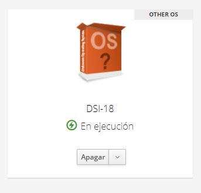

# Práctica 1 - Configuración de Máquina Virtual en el IaaS
En esta práctica se pretende configurar la **máquina virtual** que se le asignó a cada alumno en el servicio **IaaS** de la **Universidad de La Laguna**
para trabajar en la asignatura **Desarrollo de Sistemas Informáticos**. También se configurarán todas las herramientas necesarias.

## Objetivos
- **Conectar remotamente** a la máquina virtual del IaaS de una manera sencilla.
- Generar **clave pública-privada** para SSH.
- Configurar **git** y **prompt** en la máquina.
- Añadir la clave SSH pública a la cuenta personal de GitHub.
- Configurar **Node.js**.

## Desarrollo.
### Conocer la IP de la máquina virtual.
Para trabajar con la máquina virtual alojada en el servicio IaaS de la ULL, debemos conectarnos a la VPN de dicha universidad. Yo ya lo tenía configurado en mi máquina local, 
pero se pueden seguir las instrucciones disponibles en este [link](https://www.ull.es/servicios/stic/2020/12/01/servicio-de-vpn-de-la-ull/) para configurarlo.

Una vez configurado hay que conectarse a la VPN hay que acceder al servicio IaaS de la ULL (puedes hacerlo pulsando [aqui](https://iaas.ull.es/ovirt-engine/sso/login.html)).
Se deben introducir las credenciales para poder acceder. Se pueden observar todas las máquinas virtuales del usuario que están alojadas en el IaaS, debemos encender la máquina
llamada **DSI**. Después de unos minutos verá que el nombre ha cambiado, ahora es DSI-XX, donde X es un número natural comprendido entre 0-9.

A continuación haga click en el nombre de la máquina, en la parte derecha se encuentra una sección llamada **Interfaces de Red** donde verá la direccion IP asignada a su máquina
virtual. En mi caso es 10.6.129.210.

### Conectarse a la máquina virtual mediante SSH.
Lo siguiente que debemos hacer es conectarnos a la máquina virtual mediante una conexión SSH. Para ello debemos abrir una terminal en nuestra máquina local y escribir lo siguiente:
'ssh usuario@XX.X.XXX.XXX', donde en vez de XX.X.XXX.XXX debemos poner la dirección IP de la máquina virtual.

Introduzca **yes** e intro para avanzar:

Le va a pedir la contraseña, deberá introducir **usuario**:

Como observa el sistema está pidiendo una contraseña nueva, primero pedirá la actual (usuario) y luego la nueva que la pedirá dos veces. Como es obvio, la próxima vez que inicié
sesión en su máquina virtual deberá hacerlo con la contraseña nueva que le acaba de poner.

### Modificar el nombre de host de la máquina virtual
Vamos a proceder a cambiar el nombre de host de la máquina. Para ello debemos modificar el fichero /etc/hostname. En esta imagen primero mostramos el contenido actual del 
fichero (host actual), luego pretendemos cambiarlo con el comando "sudo vi /etc/hostname". Como la instrucción se va a ejecutar en modo superusuario, necesitamos 
introducir su contraseña:

Se va a abrir un editor de texto (vi) con el contenido actual, para cambiarlo debemos entrar a modo edición presionando la tecla "i" y procederemos a cambiar el nombre de la máquina, quitamos el
nombre actual e introducimos el que deseamos. En mi caso lo nombre "iaas-dsi":

Para salir del modo edición debemos presionar la tecla "esc" y guardaremos el contenido actualizado del fichero introduciendo ":wq" ("w" para guardarlo y "q" 
para salir del editor).

Después modificaremos otro fichero (/etc/hosts) actualizando el nombre host. En el fichero debemos buscar "ubuntu" que era el nombre antiguo de la máquina y ponemos el actual.
Para modificar dicho fichero ejecutamos el siguiente comando: *sudo vi /etc/hosts* y hacemos lo mismo que hicimos antes para modificar el fichero (tecla "i" para editar, "esc"
para salir del modo edición y ":wq" para guardar).

Contenido anterior:

Contenido actual:

Para que el sistema efectue los cambios hay que reiniciar el sistema, pero antes haremos una actualización del software. Primero ejecutaremos el comando *sudo apt update*.

Con esto hemos actualizado la lista de paquetes disponibles con sus versiones, pero todavía no se han instalado o actualizado en la máquina. Para hacerlo, debemos ejecutar *sudo apt upgrade*:

Durante este proceso se le va a informar el tamaño total de archivos a descargar y a liberar, si estamos de acuerdo que se realice esta operación debemos introducir *S*.

Ahora procederemos a reiniciar el sistema con el comando *sudo reboot*

Después de introducir ese comando verá que ha salido de la conexión remota, entonces deberá esperar a que la máquina virtual se reinicie para poder conectarse de nuevo.

### Configurar un alias de conexión a la máquina virtual.
Mientras la máquina se está reiniciando, podemos aprovechar y simplificar el comando de conexión (*ssh usuario@XX.X.XXX.XXX*). Lo primero que haremos es introducir un alias para el nombre de la máquina, que sustituirá a la dirección ip en el comando, es decir, en vez de introducir lo anterior podremos poner *ssh usuario@nombre_maquina*. Para ello, modificaremos el fichero /etc/hosts de nuestra máquina local introduciendo el comando *sudo vi /etc/hosts*. En el fichero aparecerá una lista de  pares de direcciones ip y nombre de máquina, al final de esa lista añadiremos una línea con la IP de nuestra máquina virtual y el nombre alias que le queremos dar. A mi máquina le he puesto como nombre *iaas-dsi*.

Lo siguiente que hay que hacer es configurar la infraestructura de clave pública-privada en nuestra máquina local. Para comprobar si ya está hecha anteriormente veremos si existe el fichero .shh/id_rsa.pub y, en caso afirmativo, cuál es su contenido (*cat .ssh/id_rsa.pub*). Si no existe, debemos ejecutar el comando *ssh-keygen* y para cada cosa que el sistema pregunte,, hay que presionar la tecla *intro* para que tome las opciones por defecto. En mi caso las claves ya existen.

Después de generar las claves (si no la tenían anteriormente) debemos copiar la clave desde nuestra máquina local a la virtual. Para ello, introducimos *ssh-copy-id usuario@nombre_maquina*, donde *nombre_maquina* es el nombre que le pusimos cuando modificamos el fichero /etc/hosts. Le va a preguntar si quiere seguir conectando, introducimos *yes*, y luego debemos introducir la contraseña (cuando el sistema la pida).

Después, como se nos indica, debemos iniciar sesión en la máquina virtual.

Para simplificar más aún el comando para acceder a la máquina virtual, de tal forma que ni tengamos que poner el nombre de usuario, lo que debemos hacer es modificar el fichero ~/.ssh/config de nuestra máquina local. Para ello hay que salir de la máquina virtual con el comando *exit*.

Ahora sí podemos modificar ese fichero, lo primero que ejecutaremos es *touch ~/.ssh/config*, luego *vi ~/.ssh/config* para modificarlo.

Debemos poner lo siguiente:

Hay que cambiar *iaas-dsi* por el nombre de su máquina.

Después de hacer lo anterior podemos conectarnos a la máquina virtual poniendo solo el nombre de la máquina (*ssh nombre_maquina*)

Debemos generar las claves pública-privada en nuestra máquina virtual, siguiendo los mismos pasos de cuando lo hicimos en local.

### Instalar y Configurar Git
Git es un sistema de control de versiones que básicamente sirve para el mantenimiento de versiones de aplicaciones cuando éstas tienen un gran número de archivos de código fuente. Para instalarlo ejecute el comando *sudo apt install git*.

Lo siguiente es configurarlo, para ello ejecute lo siguiente:

Cambie el nombre y el email e introduzca el suyo. Para comprobar que se configuró correctamente ponga el comando *git config --list*

Luego configuraremos el prompt de la terminal para que aparezca la rama actual en la que nos encontramos cuando accedemos a algún directorio que resulta estar asociado a un repositorio git. Debemos descargar este fichero [git prompt](https://github.com/git/git/blob/master/contrib/completion/git-prompt.sh) en nuestra máquina virtual. 

Lo siguiente sería introducir el comando *mv git-prompt.sh .git-prompt.sh*. Modificaremos el fichero .bashrc e añadiremos al final de dicho fichero las siguientes dos lineas:

source ~/.git-prompt.sh

PS1='\[\033]0;\u@\h:\w\007\]\[\033[0;34m\][\[\033[0;31m\]\w\[\033[0;32m\]($(git branch 2>/dev/null | sed -n "s/\* \(.*\)/\1/p"))\[\033[0;34m\]]$'

Después ejecutamos *exec bash -l*

Como verá el formato de prompt ha cambiado, pero para saber si realmente hace lo que queríamos, lo que tenemos que hacer primero es añadir la clave pública de la máquina virtual en la configuración de las claves de nuestra cuenta de GitHub. Para ello, copie la clave pública de su máquina virtual, es decir, ejecute el comando *cat ~/.ssh/id_rsa.pub* y copie la salida que produce.

Ahora acceda a su cuenta de GitHub

Lleve el cursor a la esquina superior derecha (donde aparece la foto de perfil del usuario), en el desplegable haga click en Settings (Ajustes). Luego en el panel izquierdo haga click en **SSH and GPG Keys**. Una vez hecho eso haga click en el boton **New SSH Key** (parte derecha), luego le puede dar un nombre para que le sea fácil distinguir la clave, y abajo pegue la clave que copió anteriormente. Después haga click en el botón **Add SSH Key**.

Si todo ha ido bien, ahora podría ejecutar el comando *git clone git@github.com:ULL-ESIT-INF-DSI-2021/prct01-iaas-vscode.git* para clonar un repositorio existente. Le va a preguntar si de verdad quiere clonar el repositorio de ese usuario, introduzca *yes* y pulse intro.

Con lo anterior se ha creado un directorio con la copia de ese repositorio en su máquina, para acceder ponga *cd prct01-iaas-vscode/*

Puede observar que al entrar en la carpeta el prompt muestra la rama actual en la que se está trabajando, eso fue lo que pretendíamos configurar cuando trabajamos con el fichero git_prompt.sh.

### Configuración nvm y Node.js
Node.js es un entorno en tiempo de ejecución multiplataforma, de código abierto, para la capa del servidor basado en el lenguaje de programación JavaScript, y nvm es una aplicación que nos permite tener y gestionar varias versiones de Node.js en el mismo sistema.

Ahora instalaremos nvm en nuestra máquina, ejecutando los siguientes comandos: 

*wget -qO- https://raw.githubusercontent.com/nvm-sh/nvm/v0.37.2/install.sh | bash*

*exec bash -l*

Para comprobar si se ha instalado correctamente, así como la versión, ejecutamos *nvm --version*

Después de comprobar que nvm se instaló correctamente, procederemos a instalar Node.js con el comando *nvm install node*

Como se puede ver, con Node.js también se instaló npm (Node Package Manager).

Para instalar una versión de Node.js en particular, podemos introducir *nvm install 12.0.0*

Para cambiar entre versiones, podemos ejecutar los siguientes comandos:

*nvm list* (Para ver las versiones disponibles)

*nvm use v15.8.0* (Para cambiar a la version 15.8.0, tiene que ser una que esté disponible, que esté en la lista anterior)

*node --version* (Para comprobar la versión actual de node)

*npm --version* (Para comprobar la versión actual de npm)

## Conclusiones
Con esta práctica se pretendía configurar la máquina virtual con todas las herramientas necesarias para el desarrollo de las futuras prácticas, de tal manera que después de hacer todo, podamos empezar a trabajar con Node.js y Github.

## Bibliografía
- [Guión Práctica 1](https://ull-esit-inf-dsi-2021.github.io/prct01-iaas/)
- [nvm](https://medium.com/@martinmuelas/usando-node-js-con-nvm-516062f4dcdb)
- [Node.js](https://es.wikipedia.org/wiki/Node.js)
- [Git](https://es.wikipedia.org/wiki/Git)
- [GitHub](https://github.com/)
